# GitHub Actions Deployment Setup

## 📦 What's Inside

This directory contains everything you need to deploy EduComic using GitHub Actions.

```
.github/
├── workflows/
│   └── deploy.yml              # Main CI/CD workflow
├── DEPLOYMENT.md               # Complete deployment guide
├── PLATFORM_COMPARISON.md      # Platform selection guide
├── SECRETS_CHECKLIST.md        # Quick secrets reference
└── README.md                   # This file
```

## 🚀 Quick Start

### 1. Your secrets are already configured! ✅
- `SUPABASE_URL`
- `SUPABASE_KEY`
- `OPENAI_API_KEY`
- `BLACK_FOREST_API_KEY`

### 2. Choose your deployment platform
Read **[PLATFORM_COMPARISON.md](PLATFORM_COMPARISON.md)** to decide.

**Recommended:** Vercel (frontend) + Railway (backend)

### 3. Add platform-specific secrets
See **[SECRETS_CHECKLIST.md](SECRETS_CHECKLIST.md)** for your platform.

### 4. Uncomment deployment section
Edit `workflows/deploy.yml` around line 75-105.

### 5. Push to deploy!
```bash
git add .
git commit -m "Enable deployment"
git push origin main
```

## 📚 Documentation

| File | Purpose |
|------|---------|
| **[DEPLOYMENT.md](DEPLOYMENT.md)** | Step-by-step deployment guide for all platforms |
| **[PLATFORM_COMPARISON.md](PLATFORM_COMPARISON.md)** | Compare hosting options (cost, features, setup) |
| **[SECRETS_CHECKLIST.md](SECRETS_CHECKLIST.md)** | Quick reference for required secrets |
| **[workflows/deploy.yml](workflows/deploy.yml)** | The actual GitHub Actions workflow |

## 🔄 Workflow Overview

```mermaid
graph LR
    A[Push to main] --> B[Checkout Code]
    B --> C[Setup Python & UV]
    C --> D[Install Backend Deps]
    D --> E[Create Backend .env]
    E --> F[Run Tests]
    F --> G[Setup Node.js]
    G --> H[Install Frontend Deps]
    H --> I[Create Frontend .env]
    I --> J[Build Frontend]
    J --> K[Deploy]
    K --> L[Success! 🎉]
```



## 🎯 Current Status

- ✅ Workflow file created
- ✅ Environment secrets configured
- ✅ Build steps configured
- ⏳ Deployment platform selection needed
- ⏳ Platform-specific secrets needed
- ⏳ Deployment section needs uncommenting

## 💡 Tips

- **Test locally first:** Run `npm run build` in frontend to catch issues early
- **Use staging branch:** Test deployments before pushing to main
- **Monitor Actions tab:** Watch your deployments in real-time
- **Check logs:** Detailed logs available in Actions → Workflow run

## 🆘 Need Help?

1. **Build failing?** Check the Actions tab for detailed error logs
2. **Secrets not working?** Verify names match exactly (case-sensitive)
3. **Deployment not triggering?** Make sure you uncommented the deployment section
4. **Platform questions?** Read the platform comparison guide

## 🔗 Useful Links

- [GitHub Actions Documentation](https://docs.github.com/en/actions)
- [GitHub Secrets Management](https://docs.github.com/en/actions/security-guides/encrypted-secrets)
- [Workflow Syntax](https://docs.github.com/en/actions/using-workflows/workflow-syntax-for-github-actions)

---

**Ready to deploy?** Start with [PLATFORM_COMPARISON.md](PLATFORM_COMPARISON.md) to choose your hosting! 🚀
